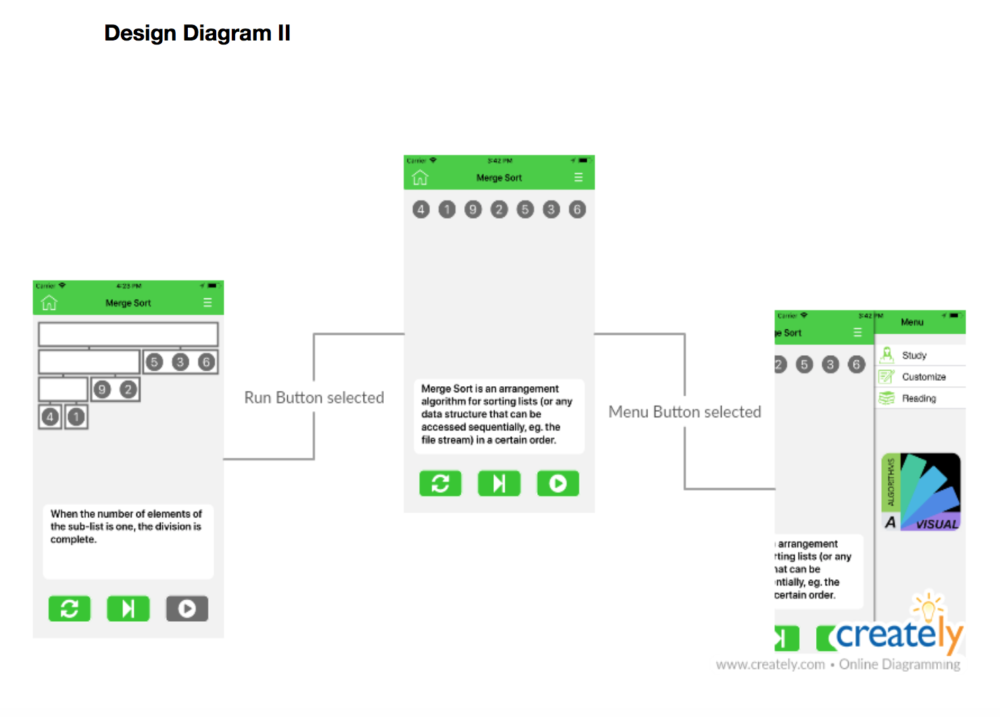
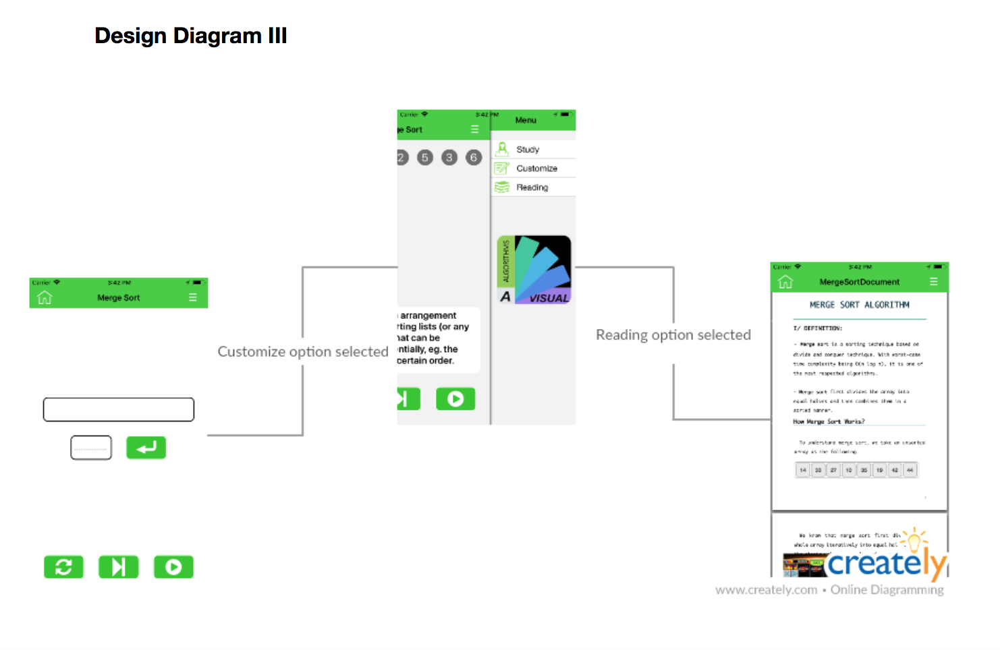

## User Interface:

Upon opening the app the user will enter the Home screen. The home screen is an all encompassing list of concepts the user may explore. For instance, if the user selects Mergesort they will open the Mergesort screen

Once a concept is selected, the user can explore the concept by watching a step-by-step analysis of the algorithm by pressing play, or, iterate through the steps by clicking the step button. 

As well as iterating through an algorithm, the user can click the options button in the top right and read additional information about the concept as well as customize some of the concepts.

