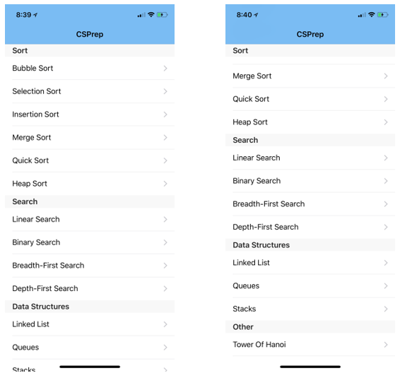
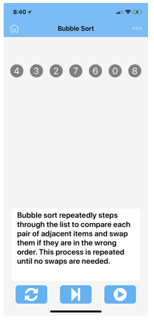
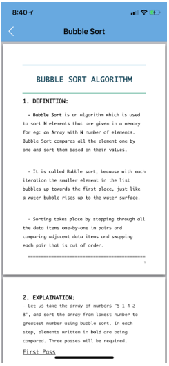

# User Manual

System requirement: iOS 8.0 or later

## Description: 

CSPrep is an educational application that helps students in Computer Science to understand some basic algorithms and data structures. Animations and thorough explanations help you understand how the algorithms work. Users also can deepen their understanding by exploring the PDF files.

## Guide:

Here is the list of Algorithms and Data Structures:

 
 Users can easily tap to explore the topic. Here is an example of a topic:
 
 

 
 
 
 To comback home screen, tap the home button 
 
 
 To reload the page, tap the reset button 
 
 
 
 To see the animation step-by-step and to view the thorough explantions, constantly tap the forward button 
 
 
 To see a full run of the algorithms, tap the auto play button 
 
 
 Note: Once you decide to see the animation step-by-step, the auto play button will be grey out  and you will not be able to use the auto play button until you tap the reset button.

To access the PDF file for this topic, tap the top right button   

Here is the view of Reading screen:

 
 
