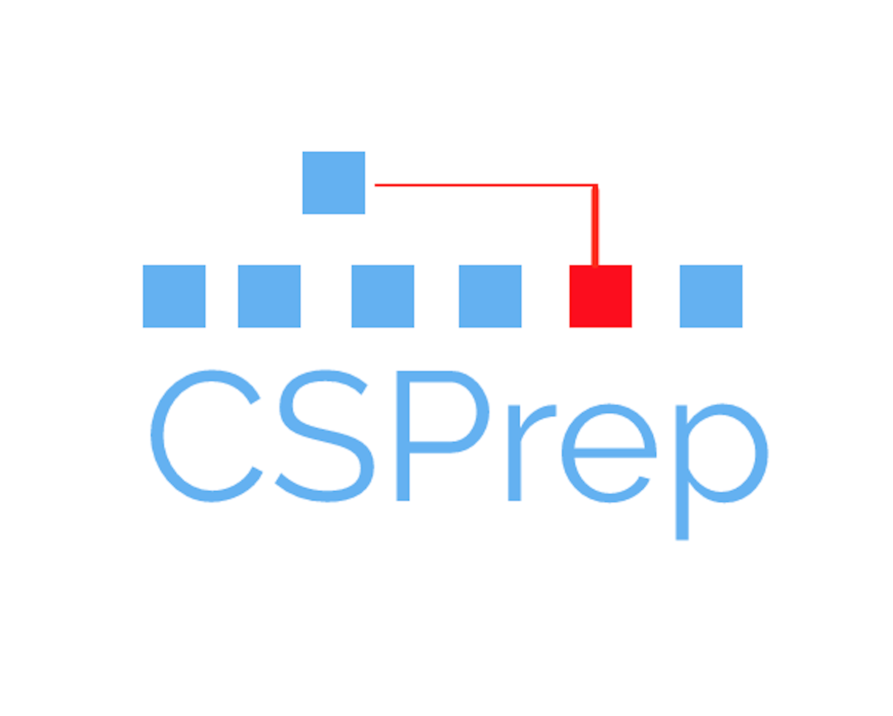

# User Manual

System Requirement: iOS 8.0 or later

## Description: 

CSPrep is an educational application that helps students learn Computer Science through the use of animations, step-by-step descriptions, and wiki style documentation pages. CSPrep breaks down foundational concepts into easily digestible 

## Guide:

Upon opening the app the user will enter the Home screen.

Home screen

 
 The Home screen is simply a table of explorable topics which include:
 
 * Bubble Sort
 * Insertion Sort 
 * Merge Sort
 * Quick Sort
 * Heap Sort
 * Linear Search
 * Binary Search
 * Breadth-First Search
 * Depth-First Search
 * Linked List
 * Queues
 * Stacks
 * Tower of Hanoi
 
For instance, if a user taps Bubble Sort the following Concept View is displayed

Bubble Sort

 
 
 To comback home screen, tap the home button 
 
 
 To reload the page, tap the reset button 
 
 
 
 To see the animation step-by-step and  view the process descriptions, consecutively tap the forward button 
 
 
 To see a full run of the algorithm, tap the auto play button 
 
 
 Note: Once you decide to see the animation step-by-step, the auto play button will be greed out  and you will not be able to use the auto play button until you tap the reset button.

To access the Concept's wiki, tap the settings button in the top right corner   

Concept View
 
 
